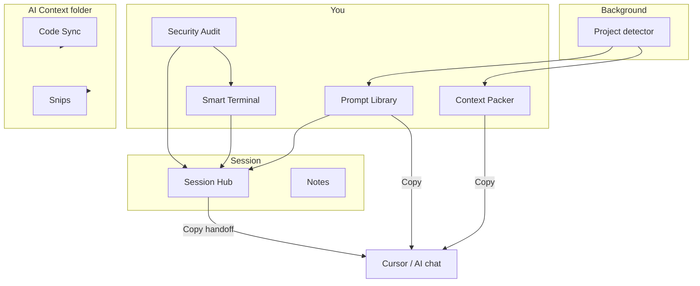

# Feature map

VibeBar is a floating toolbar plus detachable panels and windows. Everything below is available today.

## Toolbar layout

```
[Project] [AI Context] | [Library] [Terminal] [Audit] [Session] [Sync] [Packer] [Notes] [Snip] | [GitHub] [Settings] [Power]
```

| Tool | Type | Summary |
|------|------|---------|
| **Project switcher** | Control | Browse or pick from 10 recent folders |
| **AI Context folder** | Control | Create or open `<project>/AI Context/` |
| **Prompt Library** | Panel | Stack-aware templates with guardrails |
| **Smart Terminal** | Window | Embedded shell + issue/audit dock |
| **Security Audit** | Panel | Static repo scan with fix prompts |
| **Session Hub** | Panel | Timeline, pins, handoffs, AI docs sync |
| **Code Sync** | Window | Mirror folders into AI context |
| **Context Packer** | Panel | Bundle files into paste-ready prompts |
| **Notes** | Panel | Project Markdown notes with checklists |
| **Snip to AI Context** | Action | Screenshot → PNG + prompt |
| **GitHub Desktop** | Action | Open repo; badge shows branch/changes |
| **Settings** | Panel | Dock, monitors, hotkeys, Quick Launch |
| **Quick Launch** | Cluster | Cursor, Codex, and custom apps |

Panels marked **detachable** can pop out into always-on-top floating windows: Prompt Library, Security Audit, Session Hub, Context Packer, Notes, and Settings.

## How features connect



## Feature pages

| Page | Read this if you want to… |
|------|---------------------------|
| [Prompt Library](./prompt-library) | Use or author stack-aware templates |
| [Security Audit](./security-audit) | Scan, baseline risks, export SARIF |
| [Session Hub](./session-hub) | Pin, filter, hand off session context |
| [Context Packer](./context-packer) | Pack files with token estimates |
| [Smart Terminal](./smart-terminal) | Run commands and copy fix prompts |
| [Notes](./notes) | Keep project markdown with task lists |
| [Code Sync](./code-sync) | Mirror folders for assistants |
| [Snip to AI Context](./snip-to-ai-context) | Capture UI screenshots |
| [Command palette](./command-palette) | Power-user shortcuts without clicking |

## Global hotkeys

| Shortcut | Action |
|----------|--------|
| `Ctrl+Shift+H` | Hide/show toolbar |
| `Ctrl+Shift+P` | Command palette |
| `Ctrl+Shift+T` | Toggle Smart Terminal |

Hotkeys can be disabled in Settings but are **not rebindable**. Details: [Keyboard shortcuts](/reference/hotkeys).

## Data on disk

| Path | Purpose |
|------|---------|
| `.vibebar/session.json` | Session timeline and pins (git-ignored) |
| `.vibebar-audit.json` | Audit baselines and rule toggles |
| `<project>/Notes/` | Markdown notes |
| `<project>/AI Context/` | Sync target, snips, assistant docs |
