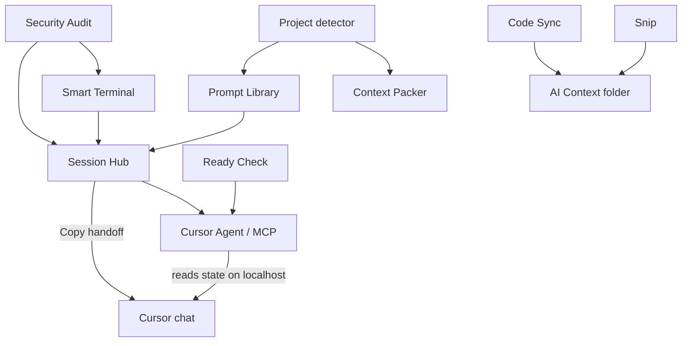

# Toolbar & tools

VibeBar is a floating toolbar plus a set of panels and windows. This page is the map. Each tool has its own page with more detail.

## Toolbar layout

```
[Project] [AI Context] | [Library] [Terminal] [Audit] [Session] [Sync] [Packer] [Ready Check] [Notes] [Snip] | [GitHub] [Quick Launch…] [Cursor Agent] [Settings] [Power]
```

## Controls (left side)

| Control | What it does |
|---------|----------------|
| **Project picker** | Browse or switch among your 10 most recent project folders. |
| **AI Context folder** | Creates `<project>/AI Context/` if missing, or opens it in Explorer. Shows a check when the folder exists. |

## Tools (center)

| Label | UI type | Summary |
|-------|---------|---------|
| **Prompt Library** | Panel | Stack-aware prompt templates with guardrails on copy. |
| **Smart Terminal** | Window | Shell in your project directory with failure detection. |
| **Security Audit** | Panel | Static repo scan with fix prompts and export. |
| **Session Hub** | Panel | Session timeline, pins, handoffs, AI docs section. |
| **Code Sync** | Window | Mirror folders into your AI context directory. |
| **Context Packer** | Panel | Pack selected or changed files to the clipboard. |
| **Ready Check** | Panel | Pre-commit trust gate — git, audit, terminal, secrets, project signals. |
| **Notes** | Panel | Markdown notes with task lists under `Notes/`. |
| **Snip to AI Context** | Action | Screen capture saved as PNG plus a vision prompt. |

**Panels** open attached to the toolbar. **Windows** (Terminal, Code Sync) open as separate floating windows. **Actions** run once (snip, GitHub).

### Detachable panels

Prompt Library, Security Audit, Session Hub, Context Packer, Ready Check, Notes, Cursor Agent, and Settings can pop out into always-on-top floating windows via the detach button in each panel header.

Smart Terminal and Code Sync are always separate windows.

## Pinned controls (right side)

| Control | What it does |
|---------|----------------|
| **Open in GitHub Desktop** | Opens the repo. Badge shows change count. **Click** when dirty for git actions (copy diff, pack changed). |
| **Quick Launch** | Built-in **Cursor** and **Codex** launchers, plus any apps you add in Settings. Opens on the current project path. |
| **Cursor Agent** | MCP connection menu (plug icon): enable the localhost server, view live status, copy the `mcp.json` snippet, and tune Cursor automation toggles. Glows green while Cursor is connected. |
| **Settings** | Dock, monitors, behavior, Quick Launch, stack overrides, quit. |
| **Power** | Quit confirmation (Settings → Quit closes immediately). |

The Session Hub toolbar button shows a badge with your **pinned count**, not total timeline entries.

## How tools connect



Project detection runs quietly when you switch folders. It feeds the Prompt Library, Context Packer presets, and terminal project commands.

## Global hotkeys

| Shortcut | Action |
|----------|--------|
| `Ctrl+Shift+H` | Hide or show toolbar |
| `Ctrl+Alt+Shift+P` | Command palette |
| `Ctrl+Shift+T` | Toggle Smart Terminal |

Toggle hotkeys in **Settings → Behavior**. They cannot be remapped in the app today. See [Keyboard shortcuts](/reference/hotkeys).

## Tool documentation

| Page | When to read it |
|------|-----------------|
| [Prompt Library](./prompt-library) | Templates, categories, custom prompts |
| [Security Audit](./security-audit) | Scanning, baselines, export |
| [Session Hub](./session-hub) | Pins, handoffs, AI docs |
| [Context Packer](./context-packer) | File bundles and presets |
| [Ready Check](./ready-check) | Pre-commit trust gate |
| [Smart Terminal](./smart-terminal) | Commands, failures, audit dock |
| [Fix With Context](./fix-with-context) | One-click failure + MVC context bundle |
| [MCP server](./mcp-server) | Cursor Agent reads VibeBar state (localhost) |
| [Notes](./notes) | Project markdown notes |
| [Code Sync](./code-sync) | Folder mirroring |
| [Snip to AI Context](./snip-to-ai-context) | Screenshots |
| [Command palette](./command-palette) | All palette actions |

## Where data lives

See [Files & storage](/reference/files-and-storage) for paths like `.vibebar/session.json`, `.vibebar-audit.json`, and `Notes/`.
