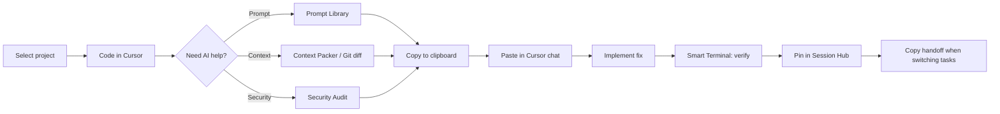

# Your First Session

This walkthrough matches how VibeBar is actually built today — copy-to-clipboard prompts, not direct AI API calls.

## The vibe coding loop



## Scenario: fix something before you commit

You're working on auth code. Something feels off, but you're not sure how to explain it to Cursor.

### 1. Select your project

Click the folder icon or use **`Ctrl+Shift+P`** → **Switch project…**.

The toolbar shows your detected stack (e.g. `React · TypeScript · Vitest`).

### 2. Run a security audit

Click **Security Audit** (scan icon) on the toolbar.

- VibeBar scans your repo with a read-only static engine.
- Findings appear with severity, rule ID, and **Copy fix prompt** actions.
- Optional: enable **npm audit** advisories for supply-chain issues.

When you copy a fix prompt, guardrails and secret redaction apply automatically if **Harden prompts** is on.

### 3. Paste into Cursor

Paste the copied prompt into Cursor chat. The prompt already includes relevant file paths, finding details, and project context — no back-and-forth to gather code.

Use **Open Cursor** on the copy toast (if Quick Launch is configured) to jump back quickly.

### 4. Verify in Smart Terminal

Press **`Ctrl+Shift+T`** to open the Smart Terminal.

```bash
npm test
```

If a command fails, the terminal dock surfaces the error. Click **Copy fix prompt** to get a debugging prompt with the failure output.

### 5. Pin and hand off

Open **Session Hub** (sparkles icon). Your copied prompts, audit findings, and terminal issues appear on the timeline.

- **Pin** the items that matter for your current task.
- When you're done or switching context, click **Copy handoff** for one structured markdown bundle.
- Or use **`Ctrl+Shift+P`** → **Copy session handoff**.

Handoffs include pinned items plus an AGENTS.md excerpt when present.

## Scenario: pack context for a refactor

1. Open **Context Packer** (package icon).
2. Use the **Changed files** preset or expand the tree and select files.
3. Click **Pack & copy** — token estimate shown before copy.
4. Paste into Cursor with your refactor instructions.

**Faster path:** **`Ctrl+Shift+P`** → **Pack changed files**.

## Scenario: git diff as a prompt

If you have uncommitted changes:

- Right-click the **GitHub** badge on the toolbar → **Copy git diff prompt**, or
- **`Ctrl+Shift+P`** → **Copy git diff prompt**

Session Hub also logs diff events when you copy.

## Scenario: screenshot for UI bugs

1. Click **Snip to AI Context** (crop icon) or palette → **Snip to AI context**.
2. Drag a box over the screen (display freezes briefly).
3. PNG saves to `AI Context/` and a copy-ready prompt lands on your clipboard.

This is a **screen capture**, not in-editor code selection.

## End of session

Before you close VibeBar or switch projects:

- Review pinned items in Session Hub.
- **Copy handoff** if you're handing off to another agent or tomorrow-you.
- Session data lives in `.vibebar/session.json` (git-ignored).

## What's next

- [Real-world workflows](/workflows/real-world-workflows) — deeper scenarios
- [Feature map](/features/) — every toolbar tool explained
- [What makes VibeBar different](/philosophy/whats-different) — the communication-layer philosophy
