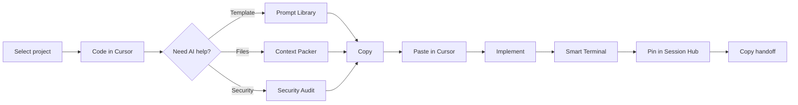

# Your first session

This walkthrough follows the real VibeBar workflow: copy a prompt, paste it in Cursor, implement, verify, and optionally hand off. VibeBar does not send prompts to an AI API for you.

## The loop



## Before you commit: review auth code

You are working on authentication. Something feels wrong, but describing it in chat would take several messages.

### 1. Select the project

Click the folder icon, or `Ctrl+Shift+P` → **Switch project…**.

The Prompt Library header should show your stack (for example `React · TypeScript · Vitest`). If it says stack unknown, you may have opened a subfolder instead of the project root.

### 2. Run Security Audit

Click **Security Audit** on the toolbar.

VibeBar runs a read-only static scan across your repo. Findings show severity, confidence, file path, and buttons to **Copy fix prompt** or **Copy test prompt**. You can also enable **npm audit** for supply-chain advisories when a lockfile is present.

If **Harden prompts** is on (default), guardrails apply and secrets are redacted before copy.

::: info Smart Terminal already open?
If Smart Terminal is open, clicking **Security Audit** on the toolbar routes results to the terminal audit dock instead of opening the audit panel.
:::

### 3. Paste in Cursor

Paste the copied prompt into Cursor chat. It already includes finding details and file context.

The copy toast may offer **Open Cursor** if Quick Launch is configured.

### 4. Verify in Smart Terminal

Press `Ctrl+Shift+T` to open Smart Terminal, then run your tests:

```bash
npm test
```

If the command fails, the dock surfaces the issue. Click **Copy fix prompt** to get output formatted for Cursor.

### 5. Pin and hand off

Open **Session Hub**. Copied prompts, audit fix copies, and terminal issues appear on the timeline.

**Pin** the entries you want to keep. The sparkles badge on the toolbar shows your pin count.

When you are ready to wrap up, click **Copy handoff**. That bundles pinned items plus an `AGENTS.md` excerpt when the file exists. You need at least one pinned item; otherwise VibeBar shows a notice.

You can also use `Ctrl+Shift+P` → **Copy session handoff**.

## Pack files for a refactor

1. Open **Context Packer**.
2. Click the **Changed files** preset, or pick files in the tree.
3. Check the token estimate, then **Pack & copy**.
4. Paste into Cursor with your refactor instructions.

Shortcut: `Ctrl+Shift+P` → **Pack changed files**.

## Copy your git diff

When you have local changes:

- **Right-click** the GitHub badge on the toolbar → copy git diff prompt (left-click opens GitHub Desktop).
- Or `Ctrl+Shift+P` → **Copy git diff prompt**.

Session Hub logs an entry when you copy.

## Screenshot a UI bug

1. Click **Snip to AI Context**, or `Ctrl+Shift+P` → **Snip to AI context**.
2. Drag a box over the screen.
3. A PNG saves to your AI Context folder and a vision prompt copies to the clipboard.

This captures the screen. It does not select code inside your editor.

## End of session

- Review pins in Session Hub.
- **Copy handoff** if you are switching tasks or ending for the day.
- Session data lives in `.vibebar/session.json` (git-ignored). See [Files & storage](/reference/files-and-storage).

## Continue reading

- [Everyday patterns](/workflows/real-world-workflows)
- [Toolbar & tools](/features/)
- [Why VibeBar exists](/philosophy/whats-different)
